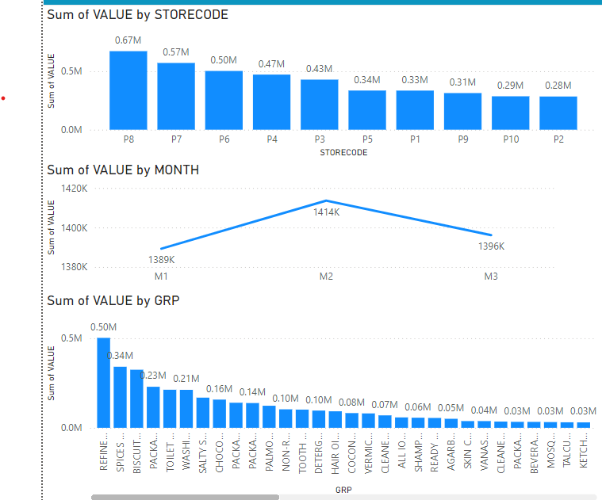
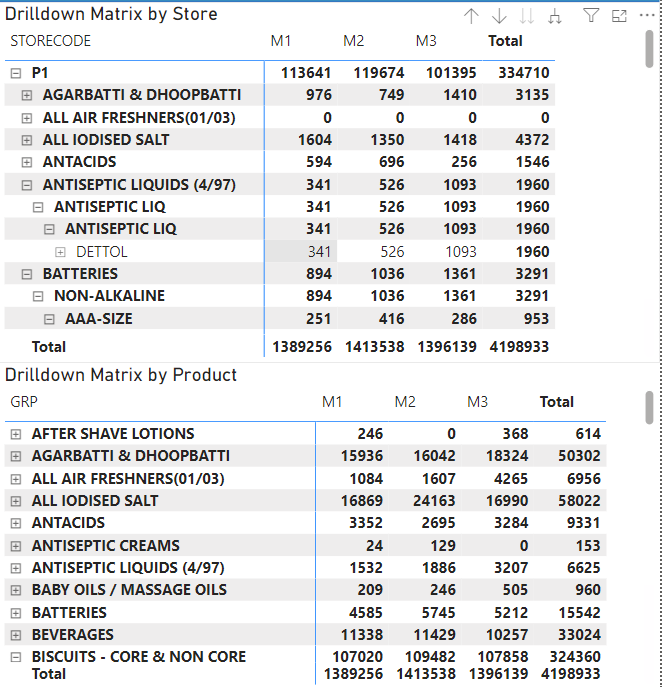
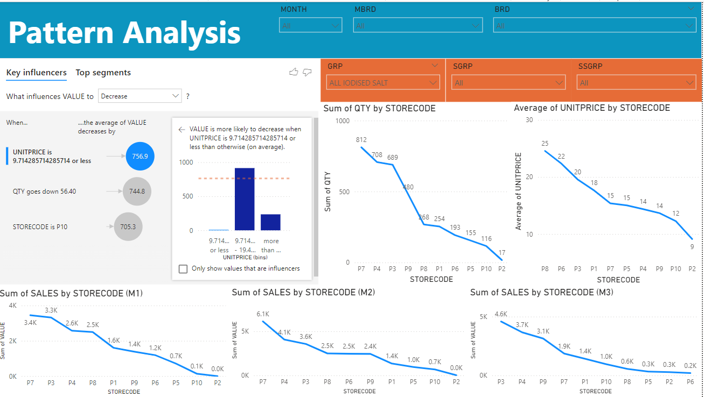

# a mini project for DW and DSS subject for MIS 241
This is a mini final project for the subject Data Warehouse and Decision Support System that are taught by Associate Professor Tran Minh Quang in University Of Technology - Vietnam National University ( BKU - VNU)
## Project Topic
A Data Warehouse and Decision Support System for POS Sales of Nielsen partner stores with the provided data in [Kaggle](https://www.kaggle.com/datasets/iamprateek/store-transaction-data?resource=download)
## Why we need this new DW and DSS System
- Nielsen Holdings plc (NYSE: NLSN) is a global measurement and data analytics company that provides the most complete and trusted view available of consumers and markets worldwide. Nielsen is divided into two business units. Nielsen Global Media, the arbiter of truth for media markets, provides media and advertising industries with unbiased and reliable metrics that create a shared understanding of the industry required for markets to function. Nielsen Global Connect provides consumer packaged goods manufacturers and retailers with accurate, actionable information and insights and a complete picture of the complex and changing marketplace that companies need to innovate and grow. Our approach marries proprietary Nielsen data with other data sources to help clients around the world understand what’s happening now, what’s happening next, and how to best act on this knowledge. An S&P 500 company, Nielsen has operations in over 100 countries, covering more than 90% of the world’s population.
- Nielsen receives transaction-level scanning data (POS Data) from its partner stores on a regular basis. These stores include large-format stores like supermarkets and hypermarkets, as well as smaller traditional grocery stores (Kirana stores), medical stores, etc., using POS machines.
## Scope of this DW and DSS System
- **Sales Performance Over Time**
Analyzing sales performance by month and store allows us to understand revenue trends and identify peak sales periods. Metrics such as transaction value (VALUE) and quantity sold (QTY) can highlight growth or decline patterns.
- **Required Data**: Includes product ID, transaction time, transaction value, and customer-related factors.
- **Analysis**: Data needs to be cleaned and standardized for easy retrieval and analysis, stored in related tables (e.g., transaction table, product table, customer table).
- **Trends by Product Categories**
Categorizing products by groups such as GRP (main group), SGRP (subgroup), and SSGRP (specific subgroup) helps identify top-performing product categories. This analysis is essential for recognizing best-selling products, seasonal demand variations, and underperforming items.
- Use **visualization tools** like Power BI or Tableau to create dashboards that display sales trends, inventory levels, and marketing campaign performance to support decision-making.
- **Store Performance Evaluation**
Comparing stores using metrics like total revenue and sales volume highlights top-performing locations and those needing improvement. This insight can guide marketing campaigns or operational adjustments at the store level.
## Star Schema of the system

### Analyze of the system
- **Fact table**: Sales Data is our fact table
- **Dimension table**: 
 1. Location table - represent a dimension of system base on Space
 2. Time table - represent a dimension of system base on Time
 3. Product table - represent by 2 table that is Company Data table and Product Category table that represent the product in the POS system
 ### Why we decided to design the system like this ?
 1. We wanted a performance report of each product and brand base on quarter
 2. Analyze which product and brand that are currently have the most sales base on Storecode , base on that analysis our DSS can recommend which product and brand we should focus base on Store 
 3. Forecast sales of each product , brand base on each month and each quarter
 ### The tool we are choosing 
**Microsoft Power BI**:
 1. Free 
 2. Easy to manipulate and control data
 3. Easy to import data
 4. Easy to design the system star schema 
 5. Easy for analyze purpose like drill down , top down analysis , descriptive
## System in usage
- Sale Forecast by Storecode , Month and Product Group

- Drilldown matrix by Store and Product 

- DAX queries of the system so that we can customize and have a more in-depth analyze of the system

- Pattern analysis

## Evaluation
- **Analyze base on Quantity and Value**:
- Overall, the increase and decrease are not too significant, indicating that sales remain stable. This can be attributed to:
1. Product diversification: There are many product lines or strong brands that help maintain steady revenue.
2. Unified business strategy: Stores distribute goods regularly, not greatly affected by specific periods.
- **Analyze Store base on Sale Revenue**:
- Analyze:
1. Geographical location: Stores in urban areas may have an advantage due to a dense population.
2. Product range: Stores selling high-value products (such as electronics or luxury cosmetics) are likely to have superior sales.
3. Marketing strategy: Some stores may execute more effective advertising or promotions.
4. Service quality: Stores with professional, friendly staff can attract loyal customers.
5. Local competition: Store P2 may face competition from another chain in the same area.
- Recommendation:
1. Evaluate the performance in more detail at P7 to extract successful lessons that can be applied to other stores.
2. Investigate the factors negatively affecting sales at P2 and P10, focusing on strategies for improvement.
3. Enhance product promotion at medium group stores like P5, P6, P9 to boost sales to higher levels.
- **Analyze base on Product Group**:
- Analyze:
1. **Essential product groups**, such as food (biscuits, cooking oil, tea, salt) and household items (detergent), account for a large share of revenue, reflecting consumer habits focused on basic needs.
2. **Non-essential or less popular product groups**, such as perfumes, toothpaste, and shoe polish, have lower sales, possibly due to not meeting current consumer preferences.
- Recommendation:
1. Enhance marketing for medium-range products: Launch additional advertising campaigns for product groups like chocolate, noodles, or laundry powder to increase customer awareness and demand.
2. Improve low-sales products: For products such as perfumes, air fresheners, or shoe polish, consider improving packaging, quality, or shifting focus to markets with higher demand.
3. Invest in high-sales product groups: Continue to strengthen promotional programs for biscuits, cooking oil, and detergent to maintain outstanding sales.

# Contributor
**Group 3**:
 1. Nguyễn Quốc An - 2470069 
 2. Phan Thị Kiều Anh - 2470278
 3. Lê Phước Tuấn - 2470276
 4. Đào Ngọc Anh - 2470070
