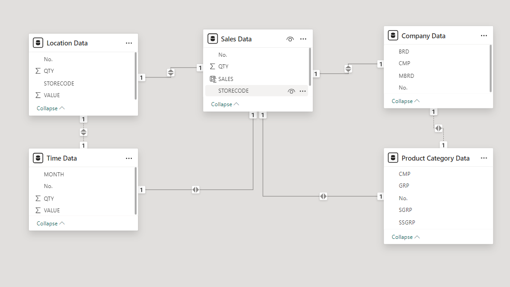
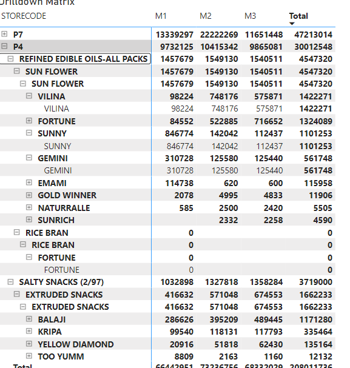

# a mini project for DW and DSS subject for MIS 241
This is a mini final project for the subject Data Warehouse and Decision Support System that are taught by Associate Professor Tran Minh Quang in University Of Technology - Vietnam National University ( BKU - VNU)
## Project Topic
A Data Warehouse and Decision Support System for POS Sales of Nielsen partner stores with the provided data in [Kaggle](https://www.kaggle.com/datasets/iamprateek/store-transaction-data?resource=download)
## Why we need this new DW and DSS System
 Kiều Anh : đây là phần của em , nhờ em gửi lên nhóm , đó là phần này : Clear system requirement (with practical methods: interview, observation, literature review, investigation on existing systems,...), explaining the necessary for having the new/proposed system
## Scope of this DW and DSS System
cần phần của Kiều Anh
## Star Schema of the system

### Analyze of the system
- **Fact table**: Sales Data is our fact table
- **Dimension table**: 
 1. Location table - represent a dimension of system base on Space
 2. Time table - represent a dimension of system base on Time
 3. Product table - represent by 2 table that is Company Data table and Product Category table that represent the product in the POS system
 ### Why we decided to design the system like this ?
 1. We wanted a performance report of each product and brand base on quarter
 2. Analyze which product and brand that are currently have the most sales base on Storecode , base on that analysis our DSS can recommend which product and brand we should focus base on Store 
 3. Forecast sales of each product , brand base on each month and each quarter
 ### The tool we are choosing 
**Microsoft Power BI**:
 1. Free 
 2. Easy to University
 3. Easy to manipulate and control data
 4. Easy to import data
 5. Easy to design the system star schema 
 6. Easy for analyze purpose like drill down , top down analysis , descriptive
## System in usage
- Sale Forecast by Storecode , Month and Product Group

- In-deep analysis of the system data 

- DAX queries of the system so that we can customize and have a more in-depth analyze of the system

## Evaluation
Ngọc Anh : đây là phần của ông
# Contributor
**Group 3**:
 1. Nguyễn Quốc An - 2470069 
 2. Phan Thị Kiều Anh - 2470278
 3. Lê Phước Tuấn - 2470276
 4. Đào Ngọc Anh - 2470070
